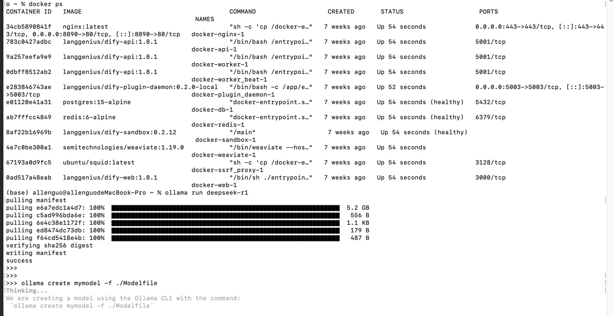
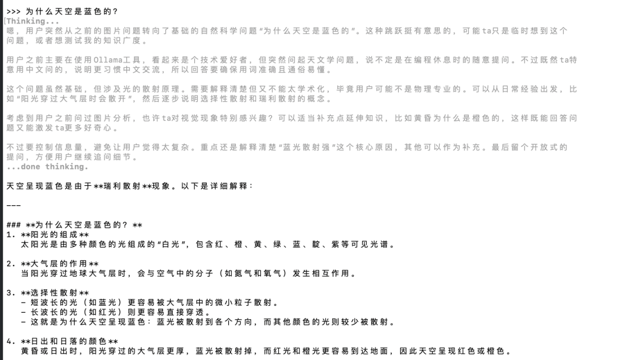
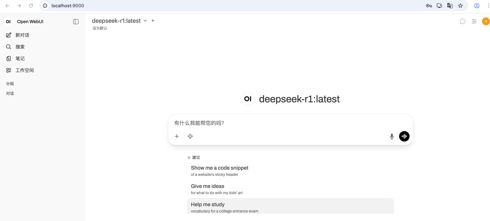
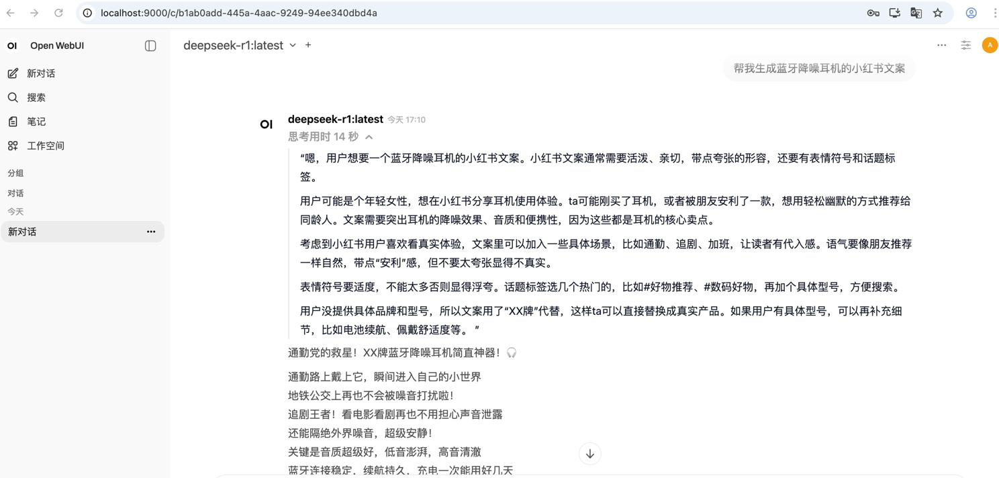

###1、执行脚本-用ollama运行deepseek-r1，本地化部署DeepSeek-R1 模型（mac版本）
ollama run deepseek-r1

###2、本地mac版安装open-webui
docker run -d -p 3000:8080 --add-host=host.docker.internal:host-gateway \
  -v open-webui:/app/backend/data \
  --name open-webui \
  --restart always \
  ghcr.io/open-webui/open-webui:main

docker run -d --network=host -v open-webui:/app/backend/data -e OLLAMA_BASE_URL=http://127.0.0.1:11434 --name open-webui --restart always ghcr.io/open-webui/open-webui:main

###后面发布打开网站失败，重新停掉和删除open-webui
docker stop open-webui && docker rm open-webui

docker run -d -p 9000:8080 -v open-webui:/app/backend/data -e OLLAMA_BASE_URL=http://host.docker.internal:11434 --name open-webui --restart always ghcr.io/open-webui/open-webui:main

###打开网站
http://localhost:9000/

