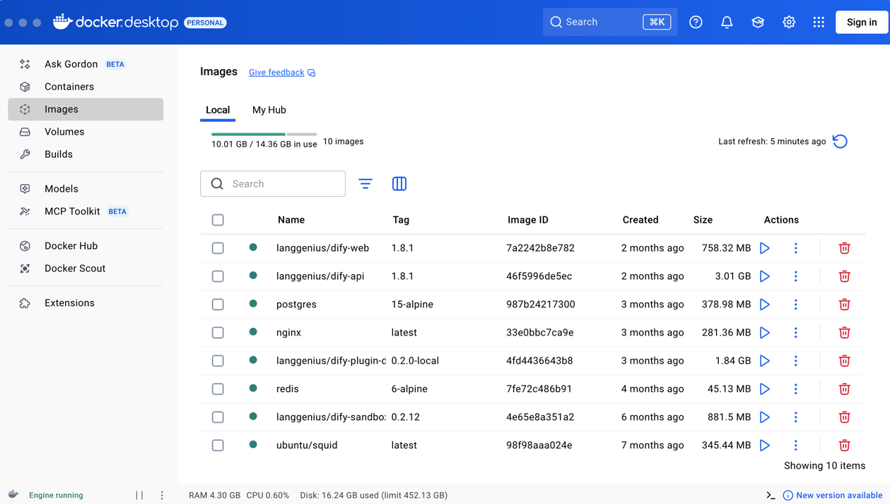
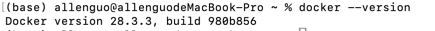
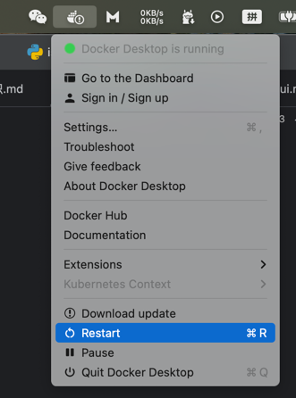
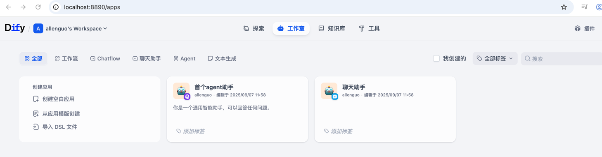
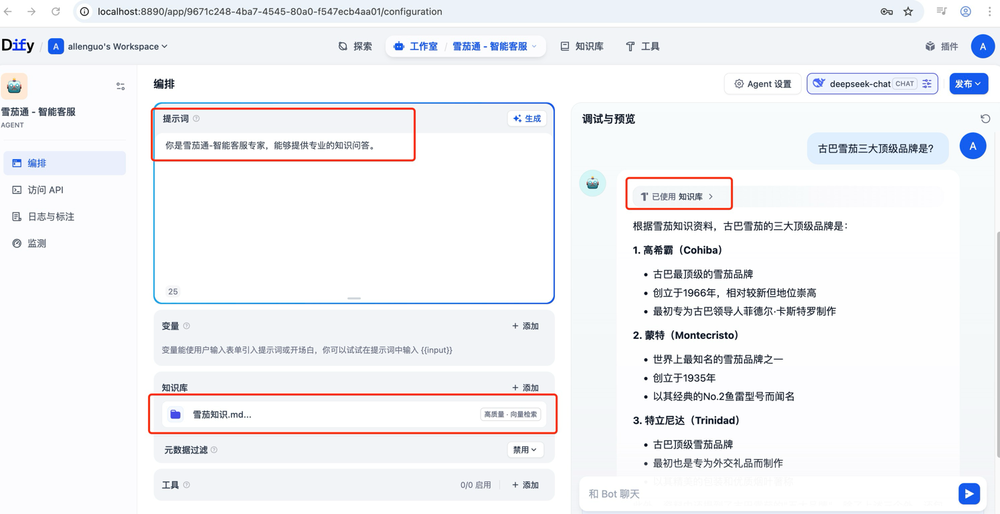
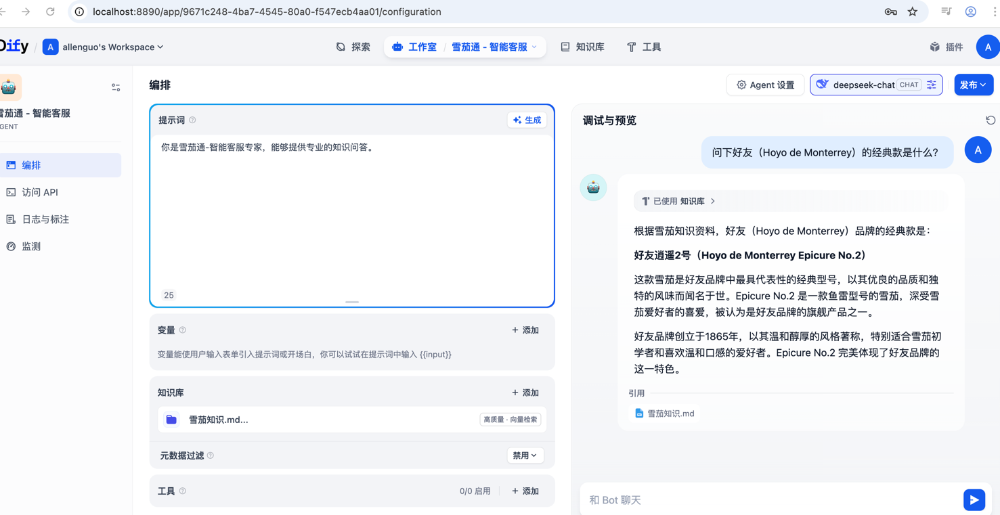
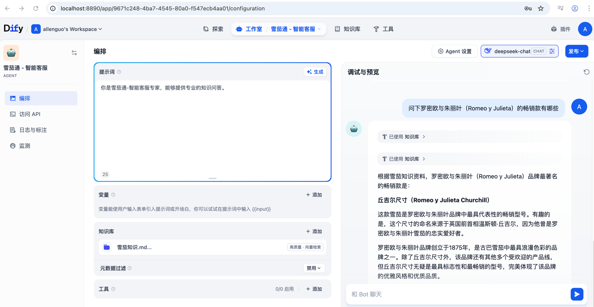

###本地部署docker和dify
###下载docker到本地部署
###打开docker官网
https://www.docker.com/
###根据自己的电脑版本选择合适的版本
###打开docker后展示

###终端验证docker是否安装成功

###下载dify配置
git clone https://github.com/langgenius/dify.git

###修改能出外网的端口
cd dify
cd docker
cp env.example.env
vim env
###可以端口EXPOSE_NGINX_PORT=8890

###修改镜像到国内，避免拉起失败
sudo vim /etc/docker/daemon.json
{
        "registry-mirrors":[
                "https://docker.registry.cyou",
                "https://docker-cf.registry.cyou",
                "https://dockercf.jsdelivr.fyi",
                "https://docker.jsdelivr.fyi",
                "https://dockertest.jsdelivr.fyi",
                "https://mirror.aliyuncs.com",
                "https://dockerproxy.com",
                "https://mirror.baidubce.com",
                "https://docker.m.daocloud.io",
                "https://docker.nju.edu.cn",
                "https://docker.mirrors.sjtug.sjtu.edu.cn",
                "https://docker.mirrors.ustc.edu.cn",
                "https://mirror.iscas.ac.cn",
                "https://docker.rainbond.cc"
        ]       
}   

###重启docker

###用docker部署
`docker compose up -d`  

###在浏览器打开，设置邮箱、用户名和密码后
http://localhost:8890/apps

###“雪茄通 - 智能客服”机器人，进行知识问答

